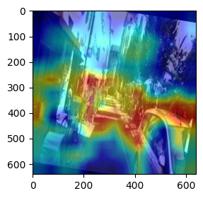
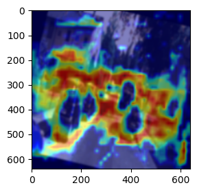
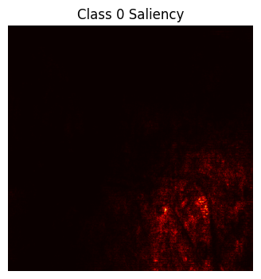
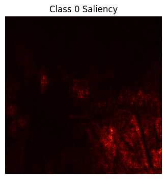
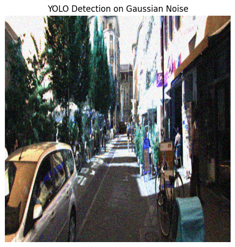
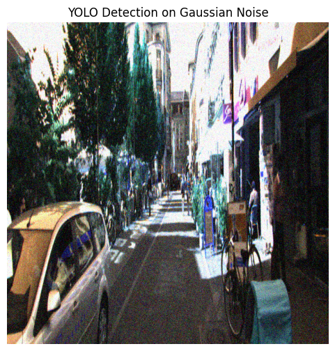
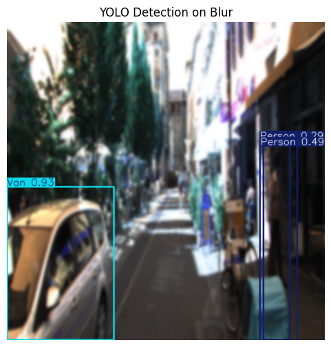
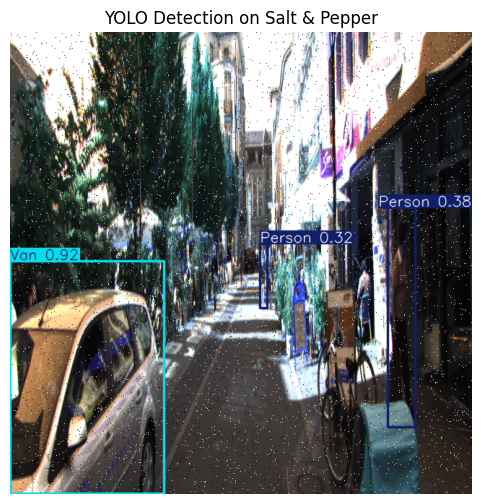
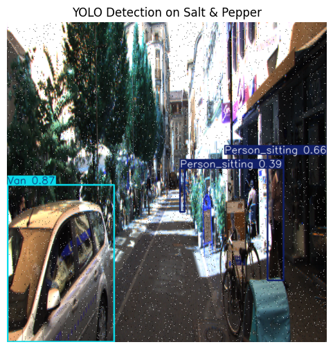

# 🔎 XAI-Driven Robustness Analysis of YOLO

<p align="center">
  <strong>Explainability, robustness, and uncertainty analysis for object detection using Ultralytics YOLOv11.</strong>
</p>

<p align="center">
  
  
  
  
  
  
</p>

---

## 📌 Overview

This project presents a **comprehensive explainable-AI (XAI) and robustness analysis pipeline** built on **Ultralytics YOLOv11** for object detection.

The workflow integrates:
- Data augmentation and preprocessing  
- Model training and evaluation  
- Robustness testing under real-world perturbations  
- Explainability using **Grad-CAM, Eigen-CAM, and Saliency Maps**  
- **Uncertainty estimation** via Monte Carlo Dropout for anomaly detection  

The goal is to **understand not only what YOLO predicts, but why it predicts and how reliable those predictions are** under challenging conditions.

---

## ⚙️ End-to-End Workflow

### 1️⃣ Data Augmentation
- `augmentation.ipynb`
- Applies:
  - Gaussian noise
  - Motion blur
  - Brightness variation
  - Horizontal flips
- Output stored in:
```

augmented_data/

```

---

### 2️⃣ Preprocessing
- `preprocess.ipynb`
- Ensures:
- Correct YOLO label formatting
- Image-label consistency
- Dataset integrity

---

### 3️⃣ Dataset Splitting
- Train / Validation / Test split: **70 / 20 / 10**
- Stored in:
```

augmented_data_split/

```

---

### 4️⃣ Model Training
- `training.ipynb`
- Trains **YOLOv11m** with:
- Early stopping
- Multi-resolution experiments (416 vs 640)
- Best weights saved at:
```

runs/detect/train*/weights/best.pt

```

---

### 5️⃣ Evaluation, Explainability & Uncertainty
- **Explainability**
- `grad_cam.ipynb`
- `eigen_cam.ipynb`
- `saliency_map.ipynb`
- **Robustness Testing**
- `robustness_testing.ipynb`
- **Anomaly Detection**
- `anomaly_detection.ipynb`
- Monte Carlo Dropout–based uncertainty estimation

---

## 📊 Training Results & Resolution Comparison

Two input resolutions were evaluated: **416×416** and **640×640**

| Image Size | Precision | Recall | mAP50 | mAP50-95 | Notes |
|-----------|----------|--------|-------|----------|-------|
| **416×416** | 0.907 | 0.829 | 0.901 | 0.697 | Best overall balance |
| **640×640** | 0.886 | 0.818 | 0.877 | 0.667 | Better for large objects |

### 📌 Interpretation
- **416×416**
- Higher overall mAP
- More computationally efficient
- Better robustness across perturbations
- **640×640**
- Slightly lower mAP
- More consistent detection of large objects (trucks, vans)
- **Pedestrian detection** remained strong across both resolutions

---

## 🎯 Explainability Analysis

### 🔥 Grad-CAM Comparison

Grad-CAM highlights spatial regions influencing predictions.

#### 416×416 Model


- Strong boundary activation
- Concentrated attention on small objects
- Slight diffusion on large vehicles

#### 640×640 Model


- More precise localization
- Higher spatial resolution
- Cleaner attention on large objects

---

### 📍 Saliency Map Comparison

Saliency maps reveal pixel-level importance.

#### 416×416 Model


- Sharp edge detection
- Compact saliency regions
- Minor background noise

#### 640×640 Model


- Cleaner gradients
- Improved texture capture
- Better large-object representation

---

## 🛡️ Robustness Testing

### Perturbation Scenarios
1. Gaussian Noise (σ = 0.01, 0.05, 0.1)
2. Motion Blur (kernel = 5, 10, 15)
3. Brightness Variation (±20%, ±40%)
4. Weather Simulation (fog, rain)
5. Salt-and-Pepper Noise

---

### 📉 Robustness Metrics (mAP50)

| Perturbation | 416×416 | 640×640 | Advantage |
|-------------|--------|--------|-----------|
| Clean | 0.901 | 0.877 | +2.4% |
| Gaussian Noise (σ=0.05) | 0.823 | 0.798 | +2.5% |
| Motion Blur (k=10) | 0.765 | 0.742 | +2.3% |
| Brightness −40% | 0.712 | 0.689 | +2.3% |
| Heavy Fog | 0.678 | 0.654 | +2.4% |

### 🔍 Key Findings
- ✅ **416×416** consistently outperforms under perturbations
- ✅ Both models degrade gracefully (15–25%)
- ⚠️ Heavy fog and extreme brightness cause the largest drops
- ⚠️ 640×640 is more sensitive to motion blur

---

## 🖼️ Visual Robustness Examples

### Gaussian Noise



### Motion Blur



### Salt-and-Pepper Noise



---

## 🎓 Key Takeaways

### ✅ Choose **416×416** if:
- Balanced detection across object sizes is needed
- Real-time inference matters
- Robustness is a priority
- Compute resources are limited

### ✅ Choose **640×640** if:
- Dataset contains mostly large or distant objects
- Fine-grained spatial detail is critical
- Compute is not constrained

---

## 🔬 XAI & Reliability Insights

- **Grad-CAM**
- 416: generalized, scale-robust attention
- 640: finer spatial precision
- **Saliency Maps**
- 416: compact, stable regions
- 640: richer texture capture
- **Robustness**
- 416 shows superior stability across corruptions
- Degradation patterns are predictable and interpretable
- **Uncertainty Estimation**
- Monte Carlo Dropout highlights anomalous predictions
- Useful for safety-critical deployment

---

## 🎯 Why This Project Matters

- Goes beyond accuracy to **trust and reliability**
- Demonstrates **XAI for object detection**
- Aligns with safety-critical applications:
- Autonomous driving
- Surveillance
- Robotics
- Smart cities

---

⭐ *If this project helped you understand YOLO beyond metrics, consider starring the repository!* ⭐
