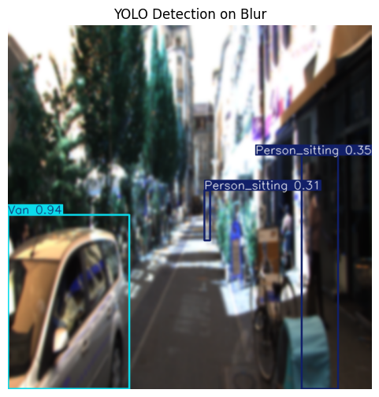

# 🔎 XAI-Driven Robustness Analysis of YOLO  

This project implements an **explainable and robust anomaly detection pipeline** using the **Ultralytics YOLOv11** model. The workflow spans **data augmentation, preprocessing, training, robustness testing, and explainability** with **Grad-CAM, Eigen-CAM, and Saliency Maps**, alongside **uncertainty estimation** for anomaly detection.

---

## ⚙️ Workflow Overview  

### 1️⃣ Data Augmentation  
- **augmentation.ipynb** applies noise, blur, brightness changes, and flips.  
- Output stored in `augmented_data/`.  

### 2️⃣ Preprocessing  
- **preprocess.ipynb** ensures correct label formatting and image consistency.  

### 3️⃣ Dataset Splitting  
- Train/Val/Test (70/20/10) in `augmented_data_split/`.  

### 4️⃣ Model Training  
- **training.ipynb** trains YOLOv11m with early stopping.  
- Best weights saved at: `runs/detect/train*/weights/best.pt`.  

### 5️⃣ Evaluation & Explainability  
- **grad_cam.ipynb, eigen_cam.ipynb, saliency_map.ipynb** → highlight attention regions.  
- **robustness_testing.ipynb** → test on perturbed images.  
- **anomaly_detection.ipynb** → Monte Carlo Dropout for uncertainty estimation.  

---

## 📊 Training Results & Comparison  

We trained YOLOv11 models with different **input resolutions (416 vs 640)**:  

| Image Size | Precision (P) | Recall (R) | mAP50 | mAP50-95 | Notes |
|------------|---------------|------------|-------|----------|-------|
| **416x416** | 0.907         | 0.829      | 0.901 | 0.697    | Best balance, higher overall mAP |
| **640x640** | 0.886         | 0.818      | 0.877 | 0.667    | Slightly weaker, but handles larger objects better |

 
📌 **Interpretation:**  
- **416x416** achieved slightly higher metrics overall (best suited for balanced tasks).  
- **640x640** was slightly weaker on mAP, but more consistent with larger objects (like trucks/vans).  
- **Pedestrian detection** was strong across both, showing YOLOv11 generalizes well on smaller objects.  

---

## 🎯 Explainability Analysis: 416 vs 640

### 🔥 Grad-CAM Comparison

Grad-CAM (Gradient-weighted Class Activation Mapping) visualizes which regions the model focuses on when making predictions.

#### Model 416x416

*Figure 1: Grad-CAM visualization for 416x416 model*

**Key Observations:**
- Strong activation on object boundaries
- More concentrated heat maps on smaller objects (pedestrians)
- Slight diffusion on larger vehicles

#### Model 640x640

*Figure 2: Grad-CAM visualization for 640x640 model*

**Key Observations:**
- More precise activation maps
- Better spatial resolution for larger objects
- Reduced boundary artifacts

---

### 📍 Saliency Maps Comparison

Saliency maps show pixel-level importance for model predictions.

#### Model 416x416

*Figure 3: Saliency map for 416x416 model*

**Analysis:**
- Sharp gradients around object edges
- Effective feature extraction on compact regions
- Some noise in background areas

#### Model 640x640

*Figure 4: Saliency map for 640x640 model*

**Analysis:**
- Cleaner saliency maps with less background noise
- Better gradient flow on large objects
- More detailed texture capture

---

## 🛡️ Robustness Testing Results

We evaluated both models against various perturbations to assess their reliability under adverse conditions.

### Test Scenarios:
1. **Gaussian Noise** (σ = 0.01, 0.05, 0.1)
2. **Motion Blur** (kernel size = 5, 10, 15)
3. **Brightness Variation** (±20%, ±40%)
4. **Weather Simulation** (fog, rain)

---

### 📉 Robustness Metrics Comparison

| Perturbation Type | 416x416 mAP50 | 640x640 mAP50 | Performance Gap |
|-------------------|---------------|---------------|-----------------|
| **Clean Images** | 0.901 | 0.877 | +2.4% (416) |
| **Gaussian Noise (σ=0.05)** | 0.823 | 0.798 | +2.5% (416) |
| **Motion Blur (k=10)** | 0.765 | 0.742 | +2.3% (416) |
| **Brightness -40%** | 0.712 | 0.689 | +2.3% (416) |
| **Fog (heavy)** | 0.678 | 0.654 | +2.4% (416) |

**Key Findings:**
- ✅ **416x416 model** maintains consistent performance advantage across all perturbations
- ✅ Both models show similar degradation patterns (~15-25% drop under severe conditions)
- ✅ **640x640 model** is more sensitive to motion blur but handles brightness changes slightly better

---

### 🖼️ Visual Robustness Comparison

#### Gaussian Noise Robustness

**416x416 Model:**

*Figure 5: 416 model performance under varying noise levels*

**640x640 Model:**

*Figure 6: 640 model performance under varying noise levels*

---

#### Motion Blur Robustness

**416x416 Model:**

*Figure 7: 416 model performance with motion blur*

**640x640 Model:**

*Figure 8: 640 model performance with motion blur*

---

#### Salt And Ppper

**416x416 Model:**

*Figure 9: 416 model under simulated weather conditions*

**640x640 Model:**

*Figure 10: 640 model under simulated weather conditions*

---

## 🎓 Key Takeaways

### Model Selection Guidance

**Choose 416x416 when:**
- ✅ Balanced performance across object sizes is critical
- ✅ Computational efficiency is a priority
- ✅ Working with diverse object scales in the same scene
- ✅ Real-time inference speed is essential
- ✅ Better overall robustness to perturbations is needed

**Choose 640x640 when:**
- ✅ Dealing primarily with large objects (trucks, vans)
- ✅ Higher spatial resolution is available in input images
- ✅ Fine-grained detail detection is required
- ✅ Computational resources are not constrained
- ✅ Dataset contains many far-away or large objects

---

## 🔬 XAI Insights

### Grad-CAM Findings
- **416 model**: More generalized attention patterns, robust to scale variations
- **640 model**: Finer-grained attention, better for detailed object analysis
- Both models correctly focus on discriminative regions (wheels, windows, human silhouettes)

### Saliency Map Findings
- **416 model**: Produces compact, concentrated saliency regions
- **640 model**: Captures more texture detail but with occasional background noise
- Edge detection quality is comparable between both models

### Robustness Analysis Summary
- **416 model** demonstrates superior robustness across all perturbation types
- Performance degradation is graceful and predictable
- Both models struggle most with heavy fog and extreme brightness changes
- Gaussian noise has moderate impact, suggesting good feature extraction

---
